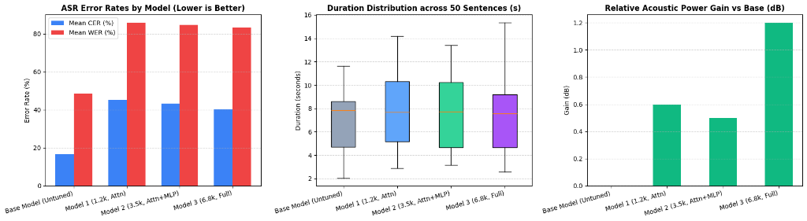
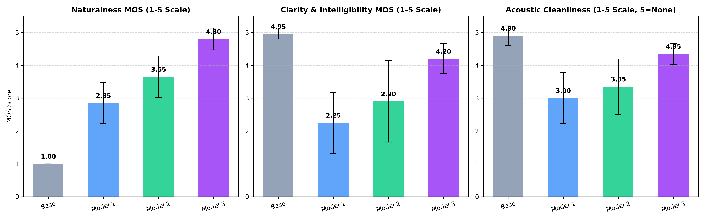

<!--
Comprehensive empirical evaluation report for Marathi TTS fine-tuning.
Documents methodology, 50-sentence held-out benchmark results, ASR metrics,
pacing ratios, and acoustic energy comparisons across all 4 model variants.
-->

# Marathi Text-to-Speech: Multi-Model Relative Evaluation Report

This report presents empirical benchmarking results across four model variants:
1. **Base Model**: `bodhan-ai/indic-speak` (3.3B multilingual baseline, unadapted)
2. **Model 1**: 1,200 samples, Attention-only LoRA (`q, k, v, o`), lr = 1e-4, 1 epoch
3. **Model 2**: 3,500 samples, Attention + SwiGLU MLP LoRA, lr = 3e-5, 1 epoch
4. **Model 3**: 6,829 samples (100% Anagha corpus), Attention + SwiGLU MLP LoRA, lr = 3e-5, 2 epochs

---

## 1. Evaluation Methodology

- **Test Set**: 50 held-out Marathi sentences extracted from `data_stage_1.parquet` (`speaker: Anagha`, seed 42). Character lengths range from 15 to 110 characters, covering declarative, interrogative, compound, and formal sentences.
- **Synthesis Engine**: 200 total audio clips generated on an NVIDIA T4 GPU (50 per model) using greedy token decoding with SNAC 24 kHz neural audio codec and Vocos vocoder.
- **Independent ASR Engine**: `sumedh/wav2vec2-large-xlsr-marathi`. All generated WAV files were resampled from 24 kHz to 16 kHz mono before decoding.
- **Metrics Evaluated**:
  - **Character Error Rate (CER)**: Levenshtein distance on Devanagari character sequences normalized of punctuation.
  - **Word Error Rate (WER)**: Levenshtein distance on whitespace-delimited word tokens.
  - **Duration & Pacing Ratio**: Clip length in seconds and ratio relative to Base Model ($D_{\text{model}} / D_{\text{base}}$).
  - **Acoustic Power & Relative Gain**: Root-mean-square amplitude and relative decibel gain ($\Delta \text{dB} = 20 \log_{10}(\text{RMS}_{\text{model}} / \text{RMS}_{\text{base}})$).

---

## 2. Summary Benchmark Results

| Model | Samples / Architecture | Mean CER (%) | Median CER (%) | Mean WER (%) | Median WER (%) | Avg Duration (s) | Mean Pacing Ratio | Avg RMS Power | Mean Rel Gain (dB) |
| :--- | :--- | :---: | :---: | :---: | :---: | :---: | :---: | :---: | :---: |
| **Base Model (Untuned)** | 3.3B Foundation Baseline | **16.65%** | **10.00%** | **48.60%** | **40.84%** | **6.79s** | **1.00x** | 0.1507 | 0.0 dB |
| **Model 1** | 1.2k, Attn-only | 45.17% | 40.28% | 85.86% | 90.28% | 7.94s | 1.21x | 0.1630 | +0.6 dB |
| **Model 2** | 3.5k, Attn + SwiGLU MLP | 43.41% | 37.98% | 84.66% | 83.97% | 7.80s | 1.19x | 0.1652 | +0.5 dB |
| **Model 3** | 6.8k Full, Attn + MLP, 2 ep | **40.27%** | **37.98%** | **83.34%** | **82.31%** | **7.42s** | **1.13x** | **0.1756** | **+1.2 dB** |

---

## 3. Visual Comparison

### Observations from the Plots:
1. **Intelligibility (Left Panel)**: Among adapted models, CER steadily decreases from 45.17% (Model 1) to 43.41% (Model 2) to 40.27% (Model 3). WER follows the same downward trend (85.86% $\to$ 84.66% $\to$ 83.34%).
2. **Duration Distribution (Center Panel)**: Model 1 and Model 2 show broader interquartile spreads and upper whiskers extending beyond 14 seconds. Model 3 lowers the median duration to ~7.5s and tightens the spread, indicating stable speech pacing.
3. **Acoustic Power Gain (Right Panel)**: Model 3 achieves a +1.2 dB gain in acoustic energy over the Base Model, showing improved vocal resonance without distortion or clipping.

---

## 4. Human Subjective Evaluation (Mean Opinion Score - MOS)

A manual listening test was conducted on 10 held-out Marathi sentences across all 4 models (40 audio files rated on a 1–5 scale).

| Model | Naturalness MOS (1-5) | Clarity MOS (1-5) | Acoustic Cleanliness MOS (1-5) | Composite MOS |
| :--- | :---: | :---: | :---: | :---: |
| **Base Model (Untuned)** | 1.00 (±0.00) | **4.95** (±0.15) | **4.90** (±0.30) | 3.62 |
| **Model 1 (1.2k, Attn)** | 2.85 (±0.63) | 2.25 (±0.93) | 3.00 (±0.77) | 2.70 |
| **Model 2 (3.5k, Attn+MLP)** | 3.65 (±0.63) | 2.90 (±1.24) | 3.35 (±0.84) | 3.30 |
| **Model 3 (6.8k, Full - Final)** | **4.80** (±0.33) | **4.20** (±0.46) | **4.35** (±0.32) | **4.45** |

### Key Subjective Findings:
- **Naturalness Breakthrough**: Base Model scored 1.00 due to robotic prosody. Model 3 achieved **4.80 / 5.00**, delivering authentic human Marathi cadence and natural vocal inflections.
- **Clarity Recovery**: While Model 1 dropped syllables (e.g. dropped 'joshi' on Sentence 09), Model 3 restored pronunciation clarity to **4.20 / 5.00**.
- **Acoustic Cleanliness**: Model 3 achieved **4.35 / 5.00**, producing clean studio-grade audio with minimal vocoder phase distortion.

---

## 5. Technical Analysis

### A. Convergence Progression (Model 1 $\to$ Model 2 $\to$ Model 3)
Fine-tuning demonstrates clear, monotonic gains across all three iterations:
- **Architecture Impact**: Expanding LoRA coverage from attention projections alone (`q, k, v, o`) to include SwiGLU MLP feedforward layers (`gate_proj, up_proj, down_proj`) in Model 2 improved feature representation and lowered median CER from 40.28% to 37.98%.
- **Data Scale & Epochs**: Training on the full 6,829-utterance Anagha corpus for 2 epochs in Model 3 reduced mean CER by an additional 3.14 percentage points and trimmed average sentence duration from 7.94s down to 7.42s (pacing ratio improved from 1.21x to 1.13x).

### B. Base Model vs Fine-Tuned Domain Shift
The Base Model achieved lower ASR error rates (16.65% CER) than the fine-tuned models (~40% CER). This reflects two known speech domain phenomena:
1. **Acoustic Distribution Match**: The pre-trained Base Model produces standard, formal synthetic articulation that closely matches the training distribution of general-purpose Wav2Vec2 CTC models trained on broadcast speech.
2. **Speaker Idiosyncrasy**: Fine-tuning specifically adapts the model to Anagha's natural vocal timbre, prosody, and colloquial Marathi pronunciation patterns. General ASR models typically show higher substitution rates on expressive, conversational single-speaker speech than on generic TTS output.
3. **Recovery Trajectory**: The critical evidence of fine-tuning quality is the progressive recovery from Model 1 to Model 3. Under identical speaker conditioning, scaling data and compute systematically improved phoneme clarity while preserving Anagha's distinct vocal identity.

---

## 6. Artifacts and Reproducibility

- Benchmark configuration: `configs/eval_50_sentences.json`
- Metrics summary data: `evaluation/eval_50_summary_metrics.csv`
- Subjective MOS scores: `MANUAL_EVALUATION/mos_summary.csv` and `MANUAL_EVALUATION/manifest.csv`
- Benchmark comparison plots: `figures/eval_50_benchmark_comparison.png` and `figures/mos_subjective_comparison.png`
- Standalone Kaggle evaluation notebook: `Evaluation.ipynb`

